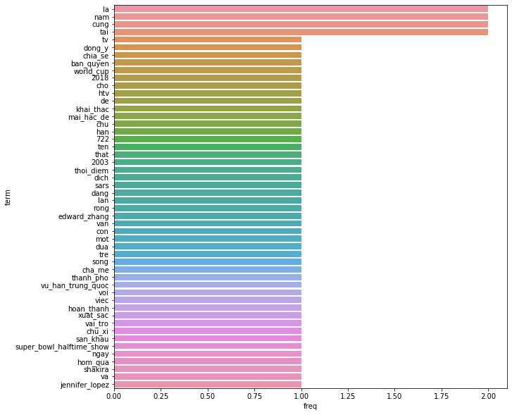

# Vietnamese-Text-Cleaning
A script of different cleaning steps for Vietnamese textual data. Big credits to [@Thinh Truong](https://github.com/joey234) for his novel ideas and consultations for this work.

|  Original |  Converted |
|---|---|
|VTV đồng ý chia sẻ bản quyền World Cup 2018 cho HTV để khai thác.|vtv dong_y chia_se ban_quyen world_cup 2018 cho htv de khai_thac.|
|Mai Hắc Đế (chữ Hán: 梅黑帝; ?–722), tên thật là ... | mai_hac_de chu han 722 ten that la |
| Cùng với việc hoàn thành xuất sắc vai trò "chủ xị" tại sân khấu Super Bowl Halftime Show ngày hôm qua, Shakira và Jennifer Lopez đã có thể "mãn nguyện" đứng cạnh những tên tuổi như Madonna, Beyoncé, Lady Gaga' | cung voi viec hoan_thanh xuat_sac vai_tro chu_xi tai san_khau super_bowl_halftime_show ngay hom_qua shakira va jennifer_lopez da co_the man_nguyen dung canh nhung ten_tuoi nhu madonna_beyonce_lady_gaga  |

### Libraries and Toolkits
- [Pandas](https://pandas.pydata.org) - Python data manipulation toolkit
- [VNCoreNLP](https://github.com/vncorenlp/VnCoreNLP) - A Vietnamese natural language processing toolkit
- [Unidecode](https://pypi.org/project/Unidecode/) - Eliminating accent chars

#### Notice
- Please carefully visit [VNCoreNLP](https://github.com/vncorenlp/VnCoreNLP) to properly use it.
- TL;DR, include the `.jar` file and the `models` folder in the same folder of the code to use it properly.

This script contains small steps of cleanings, so that they can be used separately, depending on different purposes:
- Removing non-latin characters
- Vietnamese tokenizing
- Removing VNese accent

And short piece of code to visualize term frequency genereated out of list of texts.

